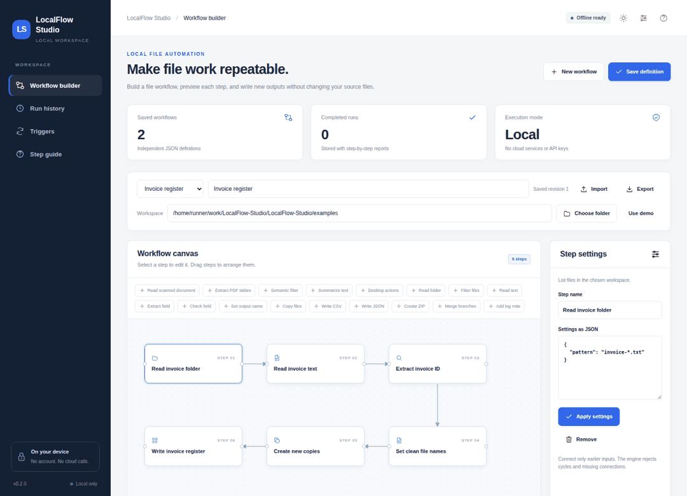
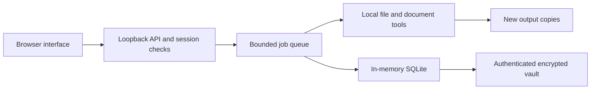

# LocalFlow Studio

Repeat file work without repeating every click.

**Local processing. No API keys. No account. CPU operation. Encrypted app database.**

[](https://github.com/danial-maqbool/LocalFlow-Studio/actions/workflows/tests.yml)




The recording uses synthetic example data. It shows the working interface, not a mockup.

## Why this exists

An invoice arrives as a scan. Read it with OCR, extract an invoice ID, create a named copy, and add a row to a register. Save the workflow for the next folder.

## What you can do

| Feature | Behavior |
| :--- | :--- |
| **Document OCR** | Read images and scanned PDFs with local Tesseract. Keep word positions and recognition notes. |
| **PDF tables** | Extract ruled or text-aligned tables. Use OCR with explicit column boundaries for scanned tables. |
| **Local semantic model** | Rank workflow records with a model fitted on the current text. Filter by cosine similarity. |
| **Source summaries** | Select representative source sentences. No cloud prompt or generated factual claims. |
| **Desktop actions** | Preview and confirm mouse, keyboard, scroll, wait, and screenshot actions for one interactive run. |
| **Persistent triggers** | Resume enabled folder watches and interval jobs after unlocking. Install a user worker for login startup. |
| **Encrypted history** | Save workflow revisions and job history in an authenticated encrypted vault. |
| **File operations** | Filter, extract fields, set output names, create copies, export CSV/JSON, and create ZIP files. |

## The six changes from the first public release

| Earlier restriction | Version 0.2.0 |
| :--- | :--- |
| No OCR | Tesseract image and scanned-PDF steps. |
| No PDF tables | Native tables, OCR rows, and explicit column boundaries. |
| No semantic model | Local latent semantic analysis, similarity filtering, and source summaries. |
| Browser-bound watching | Independent worker, saved trigger state, and user-service definitions. |
| No mouse or keyboard actions | Per-run confirmation, input actions, screenshots, and a corner stop. |
| Plain SQLite file | Password-derived AES-256-GCM vault with encrypted backups. |

The worker still needs an awake computer. Desktop actions need an unlocked supported graphical session.
These are OS conditions, not background cloud services.

## Start on your PC

Install Python 3.11 or later. Download this repository or clone it:

```sh
git clone https://github.com/danial-maqbool/LocalFlow-Studio.git
cd LocalFlow-Studio
```

**Windows**

```powershell
py -3 bootstrap.py
start.bat
```

**Linux or macOS**

```sh
python3 bootstrap.py
sh start.sh
```

Setup creates `.venv` inside this folder. It does not change system Python packages.
The first normal start asks for a vault passphrase with at least 12 characters.
Keep the passphrase. There is no password-reset server.
The browser opens the local app on `127.0.0.1:8761`.

To try synthetic data without keeping a database:

```sh
# Windows
start.bat --demo

# Linux or macOS
sh start.sh --demo
```

Demo data disappears when the process stops. Demo mode cannot create a recoverable database backup.

### Install the local tools

Python setup installs PDF, image, encryption, and semantic-model packages.
OCR also needs the Tesseract executable and local language data.
Desktop input needs the optional package set:

```sh
python bootstrap.py --desktop
```

Read [Setup](docs/SETUP.md) for OS commands, permissions, offline installation, and troubleshooting.
A one-time package installation can use the internet. Normal app processing does not contact a service.
No AI model weights are downloaded automatically.

## Keep a worker running

Closing the browser does not stop the Python worker. Enable a watcher or trigger inside the app first.
To start that worker at user login, stop the foreground app and run:

```sh
# Use .venv\Scripts\python.exe on Windows.
.venv/bin/python run.py service --install
```

This command saves the vault password in a supported OS credential store.
It installs one service for the current user. It does not request administrator rights.
The service never enables desktop mouse or keyboard actions.
Use `service --remove` to remove the service and its saved credential.
See [Background operation](docs/BACKGROUND.md).

## Where your data goes

| Location | Contents |
| :--- | :--- |
| `.local-data/app.vault` | Encrypted database snapshot. |
| `.local-data/inbox/` | Files that you upload or paste into the app. |
| `.local-data/exports/` | New outputs and reports. |
| OS credential store | Vault password only when you install a service. |

The database uses AES-256-GCM with a passphrase-derived key. SQLite operates in memory.
Backups use the same authenticated vault format. Source files, exports, and parser temporary files are not encrypted by this app.
Use OS disk encryption to protect the whole computer.

Read [Security](SECURITY.md) before processing sensitive data.
For an existing installation, follow [Upgrade and migration](docs/UPGRADING.md).

## Design



`app/` holds the project logic. `localdesk/` holds reusable local runtime components.
Every repository includes its own copy. No other repository is required at runtime.

```text
app/          Project operations and validation
localdesk/    HTTP, jobs, vault, OCR/PDF, semantic model, and user services
web/          HTML, CSS, and JavaScript with no CDN dependencies
examples/     Synthetic files for the first run
scripts/      Browser checks and release checks
tests/        Unit, integration, and adversarial regression tests
docs/         Setup, architecture, API, evidence, and recorded media
```

## Verify a change

```sh
.venv/bin/python -m pip install -r requirements-dev.txt
.venv/bin/python -m unittest discover -s tests -v
.venv/bin/python scripts/browser_check.py
```

Replace `.venv/bin/python` with `.venv\Scripts\python.exe` on Windows.
The browser check needs a Playwright browser installed once.
Use `python -m playwright install chromium` in the virtual environment.

Read [Verification](docs/VERIFICATION.md) and [Security review](docs/SECURITY_REVIEW.md).
The reports distinguish real integration tests from mocked permission checks and untested OS setup paths.
Passing tests does not prove that every possible file or desktop environment will work.

## Documentation

[User guide](docs/USER_GUIDE.md) · [Setup](docs/SETUP.md) · [Architecture](docs/ARCHITECTURE.md) · [API](docs/API.md) · [Processing boundaries](docs/LIMITS.md) · [Contributing](CONTRIBUTING.md)

## License

MIT. See [LICENSE](LICENSE).
Third-party tools and optional model weights keep their own licenses. See [Sources](docs/SOURCES.md).
