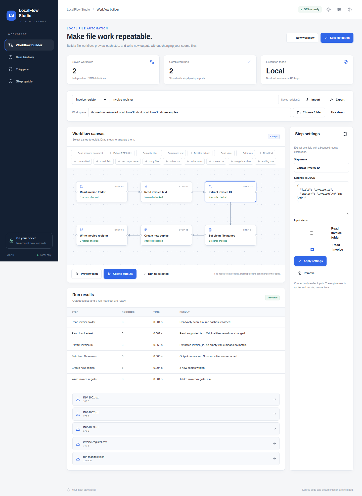
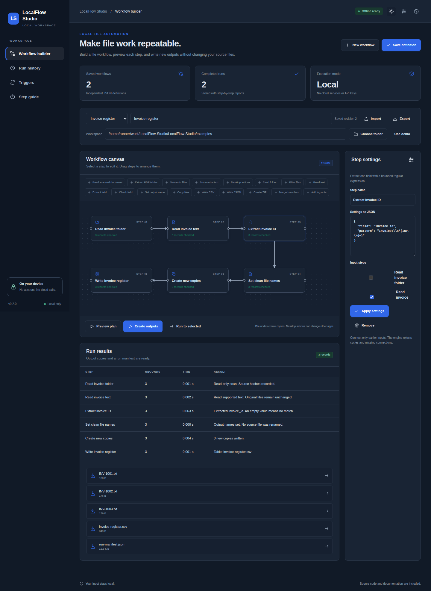

# LocalFlow Studio

Small local workflows for repetitive file and document work.

[](https://github.com/danial-maqbool/LocalFlow-Studio/actions/workflows/tests.yml)


LocalFlow Studio lets me chain common document and file tasks without sending files to a cloud service. A workflow can read a scan, extract values, rename or copy files, export data, and run again on another folder.

## Main features

- Local OCR for images and scanned PDFs
- PDF table extraction
- Field extraction, filters, naming, copy, CSV, JSON, and ZIP steps
- Local semantic filtering and source sentence summaries
- Saved workflows and persistent folder or interval triggers
- Optional desktop actions with preview and explicit confirmation
- Encrypted local history and backups

## Quick start

```bash
git clone https://github.com/danial-maqbool/LocalFlow-Studio.git
cd LocalFlow-Studio
```

**Windows**

```powershell
py -3 bootstrap.py
.\start.bat --demo
```

**Linux / macOS**

```bash
python3 bootstrap.py
sh start.sh --demo
```

For normal use, start without `--demo`. OCR needs Tesseract. Desktop control is optional and needs `python bootstrap.py --desktop` plus `--allow-desktop`.

## Screenshots

<p align="center">
  
  
</p>

## Project layout

```text
app/        workflow logic
web/        local interface
localdesk/  local runtime, vault, OCR and jobs
examples/   sample files
tests/      automated tests
scripts/    verification tools
docs/       setup, design and test notes
```

## Notes

Processing stays local after setup. OCR and table extraction can still make mistakes, so important outputs should be reviewed. Desktop actions only run after explicit confirmation.

More details: [Setup](docs/SETUP.md) · [User guide](docs/USER_GUIDE.md) · [Architecture](docs/ARCHITECTURE.md) · [Testing](docs/VERIFICATION.md) · [Security](SECURITY.md)

## License

MIT. See [LICENSE](LICENSE).
