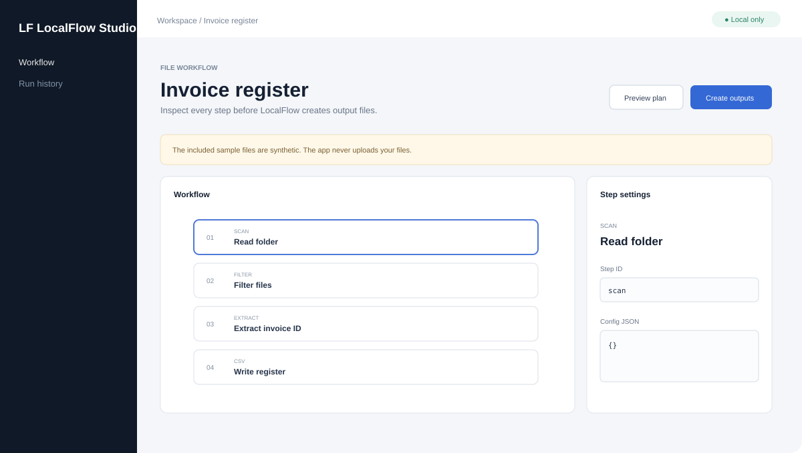
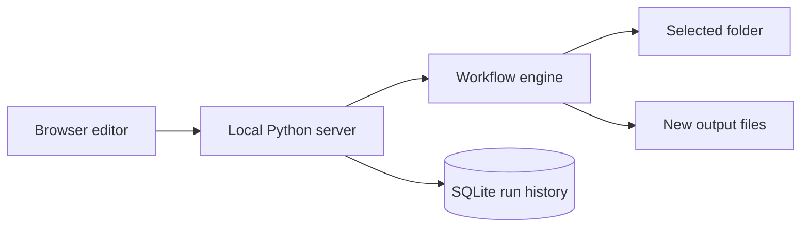

# LocalFlow Studio

A local workflow builder for repetitive file work.

**No API keys. No account. No cloud service. No model download. Python 3.11+ only.**



## Why I built it

Small file tasks become repetitive very quickly. Rename a folder of invoices. Extract one value from each file. Create clean copies. Build a CSV register. Repeat the same work next week.

LocalFlow turns that process into a saved workflow. You can inspect the plan before the app writes anything.

## What it can do

| Step | Purpose |
| --- | --- |
| Read folder | Find files inside a selected workspace |
| Filter files | Keep files that match a file pattern |
| Read text | Read local UTF-8 text files |
| Extract field | Capture a value with a regular expression |
| Set output name | Build a new file name from extracted fields |
| Copy files | Create new copies without changing source files |
| Write CSV | Build a register from workflow fields |
| Create ZIP | Pack selected files into a new archive |

The first public release keeps the workflow engine small on purpose. It does not run shell commands, arbitrary Python, mouse actions, or keyboard actions.

## Run it

### Windows

Install Python 3.11 or newer. Then double-click:

```text
start.bat
```

### Linux or macOS

```sh
sh start.sh
```

### Any platform

```sh
python run.py
```

Open `http://127.0.0.1:8761` if the browser does not open by itself.

You do not need `pip install` for the core app.

## Try the included example

The repository includes two synthetic invoices and one workflow.

1. Start LocalFlow.
2. Select **Preview plan**.
3. Check the extracted invoice IDs and planned records.
4. Select **Create outputs**.
5. LocalFlow creates renamed copies and `register.csv` under `.localflow/outputs/`.

The example does not contain real personal or business data.

## Local design



The browser talks only to the Python process on your PC. The app does not call an external API.

Read [the architecture notes](docs/ARCHITECTURE.md) for the file and data flow.

## Safety rules

LocalFlow uses a few strict rules:

- It binds to localhost.
- It skips symbolic links during scans.
- It checks that source paths stay inside the selected workspace.
- It checks file hashes again before some operations.
- It writes generated files to a separate output folder.
- It never evaluates code from a workflow.
- It limits each scanned file to 25 MiB in this release.
- CSV values that start like spreadsheet formulas get a leading apostrophe.

These controls reduce risk. They do not replace normal backups or file review.

Read [SECURITY.md](SECURITY.md) before you use sensitive files.

## Test it

```sh
python -m unittest discover -s tests -v
```

The test suite checks workflow validation, preview mode, copy and CSV output, source-file preservation, unsafe output names, the local status API, and the web entry page.

GitHub Actions runs the tests on Ubuntu, Windows, and macOS with Python 3.11, 3.12, and 3.13.

## Repository map

```text
LocalFlow-Studio/
├── localflow/
│   ├── engine.py       # workflow validation and execution
│   └── server.py       # local HTTP API and SQLite history
├── web/
│   ├── index.html      # interface shell
│   ├── app.js          # workflow UI
│   └── style.css       # local styles
├── examples/
│   ├── workflow.json   # reusable example workflow
│   └── inbox/          # synthetic input files
├── tests/              # standard-library tests
├── docs/               # architecture and media
├── run.py              # application entry point
├── start.bat           # Windows launcher
└── start.sh            # Linux and macOS launcher
```

## Reuse it

Workflow files are plain JSON. The engine is a normal Python module. You can import it without starting the browser UI.

```python
from pathlib import Path
from localflow.engine import WorkflowEngine, load_workflow

workflow = load_workflow(Path("examples/workflow.json"))
result = WorkflowEngine(
    Path("examples/inbox"),
    Path("my-output"),
).run(workflow)

print(result.outputs)
```

This makes the engine useful in scripts, scheduled local jobs, and other desktop tools.

## Current limits

Version 0.1.0 focuses on safe text-file workflows.

- It does not include OCR.
- It does not include PDF table extraction.
- It does not include semantic search or an AI model.
- It does not watch folders after the app closes.
- It does not provide general desktop mouse or keyboard automation.
- It does not encrypt `.localflow/localflow.db`.

These limits are explicit so users can tell what the current release actually does.

## License

MIT. See [LICENSE](LICENSE).
