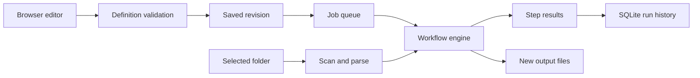

# Architecture

## Data flow

## Application model

A workflow contains nodes and directed edges. The engine rejects cycles before it starts. Each node receives the records from its parents. A record holds a source path, hash, name, and extracted fields. A run uses a snapshot of the definition so later edits do not change an active job.

## Design choices

The graph is acyclic by design. Bounded records and subprocess extraction make failures easier to isolate. A preview executes the same record transformations as a real run, but it has no output directory. A real run writes a manifest with the definition and step results.

## Shared runtime

`run.py` loads `project.json`, creates the app service, and starts a loopback HTTP server.
`web/app.js` calls the JSON API. `web/common.js` holds shared UI controls.
The app service applies validation before it starts a background job.

The job pool has two workers and permits at most eight queued or active jobs.
Each job stores status, progress, and its result in SQLite. Cancellation is cooperative.
An interrupted process does not prove that an operation finished. Unfinished prior jobs get an interrupted status at startup.

SQLite runs in memory. After a committed transaction, the vault serializes and encrypts an authenticated snapshot with atomic replacement. The filesystem stores source inputs and generated artifacts.
A database backup does not include inbox files or generated artifacts. Copy the complete stopped data directory to back up those files too.

## Trust boundary

The browser and Python process belong to the same user. A request token, Host checks, and Origin checks reduce requests from unrelated web pages.
The loopback server is not an internet-facing deployment server. Local malware or another process with the same account can still read local data.

Path and archive checks do not replace an operating system sandbox. Optional parsers increase the attack surface.
Do not process hostile files in a privileged account. The app does not offer authentication for multiple users.

## Version 0.2.0 components

`localdesk/vault.py` derives a key with scrypt and encrypts snapshots with AES-256-GCM. A file lock prevents competing writers. A failed persistence operation restores the previous committed in-memory snapshot.

`localdesk/documents.py` starts bounded PDF and OCR workers. `localdesk/semantic.py` fits local corpus-derived models. No runtime request uploads documents or downloads model weights.

`run.py worker` serves the same API without opening a browser. `localdesk/services.py` generates a current-user login service. `localdesk/credentials.py` accepts supported OS credential stores, not plaintext fallback stores.

Saved watchers resume only after the vault unlocks. Desktop automation remains opt-in and interactive. An interrupted job remains interrupted; a restart does not silently repeat external side effects.
