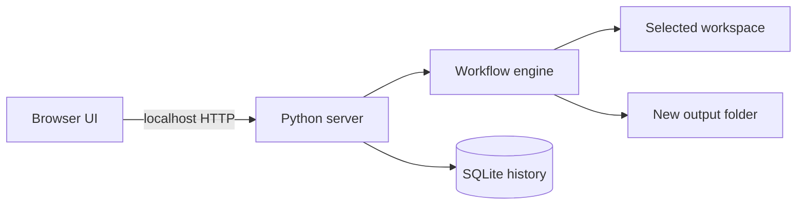

# Architecture

LocalFlow Studio has three small layers.

## Browser UI

The UI loads from the local Python process. It shows the workflow as ordered blocks. A user can inspect and edit each block before a run.

## Python server

The server binds to `127.0.0.1`. It serves static files and a small JSON API. It stores saved workflows and run records in `.localflow/localflow.db`.

## Workflow engine

The engine supports scan, filter, read, extract, rename, copy, CSV, and ZIP steps. It checks paths before file access. Source files stay unchanged. A real run writes new files to a separate output folder.

## Security boundaries

LocalFlow does not execute shell commands from workflow data. It does not evaluate Python code. It skips symbolic links during folder scans. It limits input file size to 25 MiB per file. The server rejects non-localhost binding in `run.py`.
